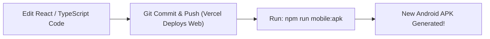

# 📱 SMART KHATA — MOBILE BUILD GUIDE
**For Beginners & Production Operators**

Welcome! This guide explains how to build, test, and maintain the **Smart Khata** Android application.

---

## 🚀 Quick Start: Build Your Android App in One Command

You do not need to memorize complicated Android or Gradle terminal commands. We have built simple, automated scripts right into your project.

### 1. Build an Installable APK (For Testing on Real Phones)
Open your terminal in the project root and run:
```bash
npm run mobile:apk
```

**What this does automatically:**
1. Compiles your latest React/TypeScript web app (`npm run build`).
2. Copies the web assets into the Android native project (`npx cap sync android`).
3. Uses your installed Java (JDK 21) and Android SDK (API 36).
4. Compiles the native Android application shell using Gradle.
5. Produces an installable `.apk` file.

**Where to find the APK:**
```
android/app/build/outputs/apk/debug/app-debug.apk
```

---

### 2. Install the APK on a Connected Phone or Emulator
Connect your Android phone to your PC via USB (with **USB Debugging** enabled in Developer Options), then run:
```bash
adb install "android/app/build/outputs/apk/debug/app-debug.apk"
```
Or simply copy the `app-debug.apk` file to your phone (via USB cable, Google Drive, or WhatsApp) and tap it to install!

---

### 3. Build an Android App Bundle (AAB) for Google Play Store
When you are ready to upload to Google Play Console, run:
```bash
npm run mobile:aab
```

**Where to find the AAB:**
```
android/app/build/outputs/bundle/release/app-release.aab
```
Upload this `.aab` file directly to the Google Play Console under **Production** or **Internal Testing**.

---

### 4. Open in Android Studio
If you ever want to open the native project in Android Studio to inspect code, run profilers, or configure signing keys:
```bash
npm run mobile:open
```

---

## 🔄 How Future Web Updates Work (The Update Pipeline)

Whenever you make improvements to the Smart Khata web app (e.g. modifying screens, fixing translations, updating calculations):



1. **You edit code in `src/` as normal.**
2. **Commit & push to GitHub.** (Vercel automatically updates the web site).
3. **Run `npm run mobile:apk`.** (The script automatically pulls your latest web build into the Android app and generates a fresh APK).
4. You never need to configure Android Studio from scratch again!

---

## 🛡️ Key Guarantees of Your Android App
1. **No Browser Address Bar**: The app runs as a real Android application without Chrome or Safari address bars.
2. **Direct WhatsApp Handoff**: Tapping "Send on WhatsApp" opens the customer's WhatsApp chat directly (even for unsaved numbers), with 0 delay and no generic OS share sheets.
3. **Google Login via Chrome Custom Tabs**: Google Sign-In uses secure native Chrome Custom Tabs and redirects back into Smart Khata seamlessly (`com.smartkhata.app://auth-callback`).
4. **Offline Resilience & Data Security**: All database operations connect securely to your production Supabase backend using Row Level Security (RLS). No sensitive keys are baked into the app.
5. **Least Privilege Permissions**: Only `INTERNET` access is declared. Zero unnecessary permissions (no camera, contacts, or storage access required).

---

## 📚 Complete Technical Documentation
For deep technical architecture, release keys, and Google Play compliance, see:
- [`docs/ANDROID_ARCHITECTURE.md`](./docs/ANDROID_ARCHITECTURE.md)
- [`docs/ANDROID_RELEASE_PROCESS.md`](./docs/ANDROID_RELEASE_PROCESS.md)
- [`docs/GOOGLE_PLAY_MAINTENANCE.md`](./docs/GOOGLE_PLAY_MAINTENANCE.md)
- [`docs/GOOGLE_PLAY_RELEASE_CHECKLIST.md`](./docs/GOOGLE_PLAY_RELEASE_CHECKLIST.md)
