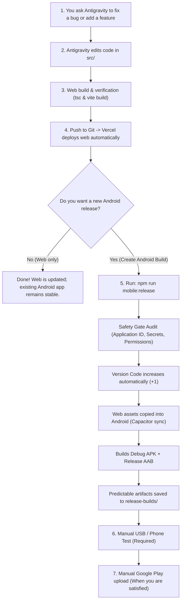

# 🚀 Smart Khata — Future Android Update & Release Workflow
**A Simple, Practical Guide for Everyday Maintenance**

This document explains exactly how future bug fixes and new features move from source code to your Android phone and the Google Play Store.

---

## 🎯 The Big Picture (How Everything Connects)



---

## 📋 Step-by-Step Explanation

### A. How Antigravity Changes the Existing Code
When you request a change:
- Antigravity edits the existing React/TypeScript files inside `src/` (such as `src/App.tsx`, `src/components/`, or `src/lib/`).
- Antigravity does **not** create a second Android project or duplicate business logic.

---

### B. How the Web Version Gets Deployed
- Whenever code changes are committed and pushed to GitHub (`git push origin main`), **Vercel detects the push and automatically deploys the web version**.
- This is completely independent from the Android app on users' phones.

---

### C. How Android Gets Synced
- When an Android update is needed, Capacitor sync copies your compiled `dist/` web files directly into Android's native asset directory:
  ```bash
  npm run mobile:sync
  ```
  *(Or handled automatically by `npm run mobile:release`)*.

---

### D. How the APK is Generated
- An **APK** is the package file that installs directly on Android phones.
- Running:
  ```bash
  npm run mobile:apk
  ```
  uses your computer's installed Java (JDK 21) and Android SDK to compile the native code and output `android/app/build/outputs/apk/debug/app-debug.apk`.

---

### E. How the AAB is Generated
- An **AAB (Android App Bundle)** is the official format required by the Google Play Store.
- Running:
  ```bash
  npm run mobile:aab
  ```
  compiles and packages an optimized bundle ready for Play Console upload at `android/app/build/outputs/bundle/release/app-release.aab`.

---

### F. How `versionCode` Increases
- Google Play strictly requires that **every single upload has a higher `versionCode` than the last one**.
- Our automated script (`scripts/bump-version.js` & `npm run mobile:release`):
  1. Reads `android/release-manifest.json` and `android/app/build.gradle`.
  2. Increases `versionCode` by **+1** (e.g., from `1` to `2`).
  3. Bumps `versionName` (e.g., from `1.0.0` to `1.0.1`).
  4. Records the exact date and Git commit hash into `android/release-manifest.json`.

---

### G. How to Install the New APK on Your Phone
There are two easy ways:

#### Option 1: Using USB Cable (Recommended for developers)
1. Plug your phone into your computer via USB.
2. Ensure **USB Debugging** is enabled in phone settings.
3. Run:
   ```bash
   adb install "android/app/build/outputs/apk/debug/app-debug.apk"
   ```

#### Option 2: Direct File Transfer (No technical setup needed)
1. Locate the generated APK:
   ```
   release-builds/SmartKhata-latest-debug.apk
   ```
2. Send it to your phone via USB cable, Google Drive, or WhatsApp.
3. Tap the file on your phone and choose **Install**.

---

### H. How to Test Before Play Store Release
Always perform this 2-minute test on a real phone before uploading to Google Play:
1. **Cold Launch**: Tap the app icon $\to$ verify the splash screen and immediate dashboard load.
2. **Google Login**: Tap "Continue with Google" $\to$ verify Chrome Custom Tab opens and returns to your shop dashboard.
3. **Receipt & WhatsApp**: Create a test transaction $\to$ tap **Send on WhatsApp** $\to$ verify the customer's chat opens directly with the complete receipt text.
4. **Android Back Button**: Tap the hardware back button when a receipt modal is open $\to$ verify it closes the modal instead of exiting the app.

---

### I. How to Know Which Git Commit Produced the APK
- At the end of every build, the pipeline prints the exact 7-character Git commit hash (e.g. `e749946`).
- It is also permanently recorded in `android/release-manifest.json`.

---

### J. How to Know Which Version is Installed
- Open **Phone Settings $\to$ Apps $\to$ Smart Khata**.
- The version name (e.g., `1.0.1`) and build code are displayed.
- Inside the app, the version is also listed in the Profile & Settings menu.

---

### K. How to Rollback Source Code Safely
If an error is discovered in a recent change:
```bash
git revert HEAD
git push origin main
npm run mobile:release
```
This safely creates a new release with an increased `versionCode` containing the reverted working code, satisfying Google Play's requirement that versions must always move forward.

---

### L. How to Avoid Accidentally Releasing a Broken Build
Our built-in **Safety Gate Audit** (`scripts/verify-release-safety.js`) runs before every release build and automatically **aborts** if:
- TypeScript fails to compile.
- Application ID was modified from `com.smartkhata.app`.
- Keystores or passwords are accidentally tracked in Git.
- Unauthorized native permissions (such as camera, SMS, or contacts) were introduced.

---

### M. Which Steps Are Automatic
- ✅ TypeScript type-checking and bundling (`npm run build`).
- ✅ Copying web assets to native Android (`npx cap sync android`).
- ✅ Incrementing `versionCode` and recording history in `release-manifest.json`.
- ✅ Compiling the Debug APK and Release AAB.
- ✅ Copying artifacts to predictable paths in `release-builds/`.

---

### N. Which Steps Require Your Manual Approval
- ✋ **Testing on your physical phone**: You decide when a build is fully tested and ready.
- ✋ **Google Play Console upload**: Antigravity **never** automatically publishes to Google Play. You log into Google Play Console and upload `app-release.aab` when you choose to release.
